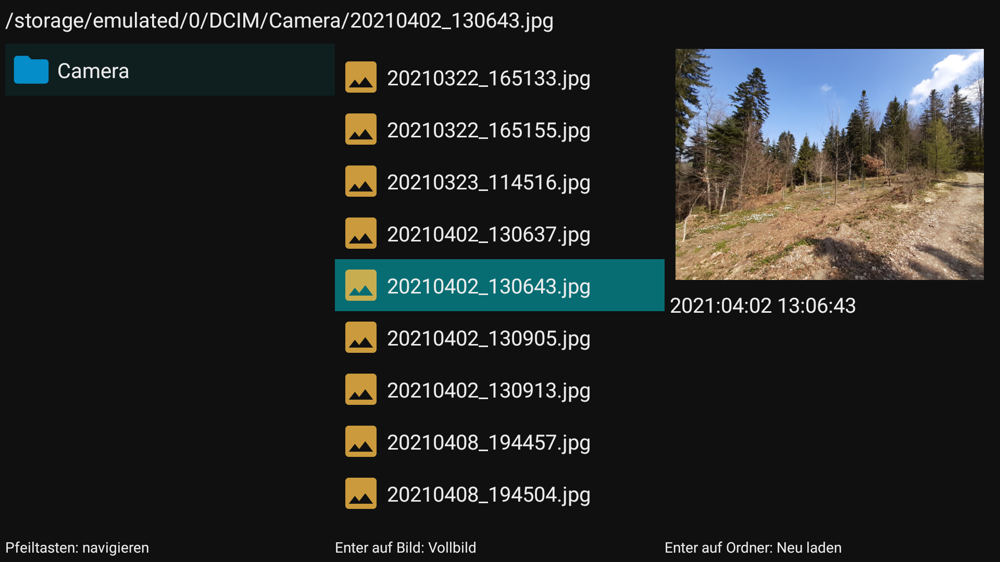
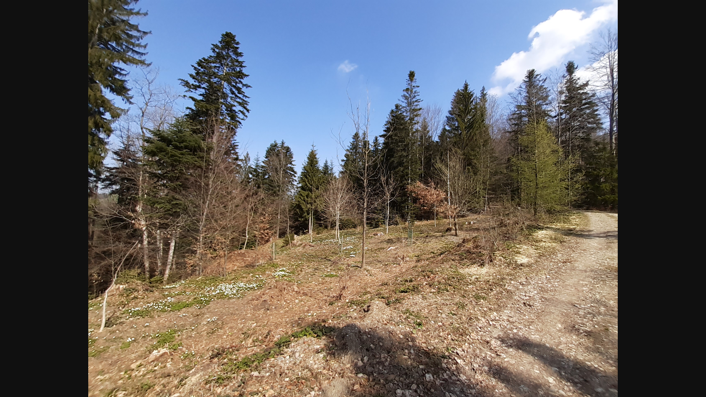

# PhotoViewer

## Description
Android TV app for viewing Images.
The goal is to be able to quickly navigate between folders, fast loading of directory contents and most importantly, images should be sorted according to their creation date (if possible). The creation dates are read from the Exif Data of an Images.

Navigation works only with a Dpad.
- Pressing Enter on Folder: reload folder
- Pressing Enter on Image: open Image in Fullscreen mode
- Right/Left in Fullscreen mode: view next/previous image

## Development
Contribution is encouraged.
